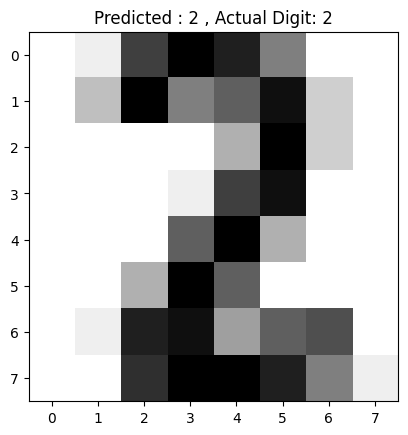

# Handwritten Digit Recognition

---


## Overview
This project involves building a Machine Learning model to recognize handwritten digits (0-9) using the **`digits` dataset** from `sklearn.datasets`. The model is trained, evaluated, and tested to classify images of handwritten digits into their respective categories.

## Objective
1. Develop a robust model to classify handwritten digits accurately.
2. Use dimensionality reduction and visualization techniques to analyze data.
3. Build an intuitive pipeline for training, testing, and predicting digits.
4. Explore practical applications of handwritten digit recognition.


## Dataset
- **Source**: `load_digits` function from `sklearn.datasets`.
- **Images**: 8x8 grayscale images representing digits from 0 to 9.
- **Labels**: Corresponding digit labels for each image.


## Project Workflow
1. **Data Loading and Exploration**  
   - Load the dataset and explore its structure, shape, and characteristics.

2. **Data Visualization**  
   - Display sample images from the dataset.
   - Use PCA for 2D visualization of digit clusters.

3. **Preprocessing**  
   - Reshape image data for model compatibility.
   - Normalize pixel values for consistent scaling.

4. **Model Development**  
   - Train a **Random Forest Classifier** on the dataset.
   - Split the data into training and testing sets for evaluation.

5. **Evaluation**  
   - Use metrics like accuracy, classification report, and confusion matrix to evaluate model performance.

6. **Prediction**  
   - Test the model's predictions on unseen data and visualize results.

---

## Dependencies
- Python 3.7+
- Libraries:  
  - `pandas`, `numpy`, `matplotlib`, `seaborn`, `sklearn`

Install the required libraries using:
```bash
pip install -r requirements.txt
```


## Usage
1. Clone the repository:
   ```bash
   git clone https://github.com/<username>/Handwritten-Digit-Recognition.git
   cd Handwritten-Digit-Recognition
   ```

2. Open the Jupyter Notebook:
   ```bash
   jupyter notebook Hand_Written_Digit_Recognition.ipynb
   ```

3. Run the cells step-by-step to load the dataset, preprocess data, train the model, and visualize results.


## Results
- Achieved an accuracy of **98.33%** on the test set.
- Successfully visualized data clusters using PCA.
- Model predictions align well with actual labels, showcasing high reliability.


## Example Output
#### Sample Images and Predictions:



## Future Work
- Extend the project to recognize digits from real-world images.
- Integrate the model into a web or mobile application.
- Experiment with other machine learning or deep learning models like CNNs.


## License
This project is licensed under the MIT License.
